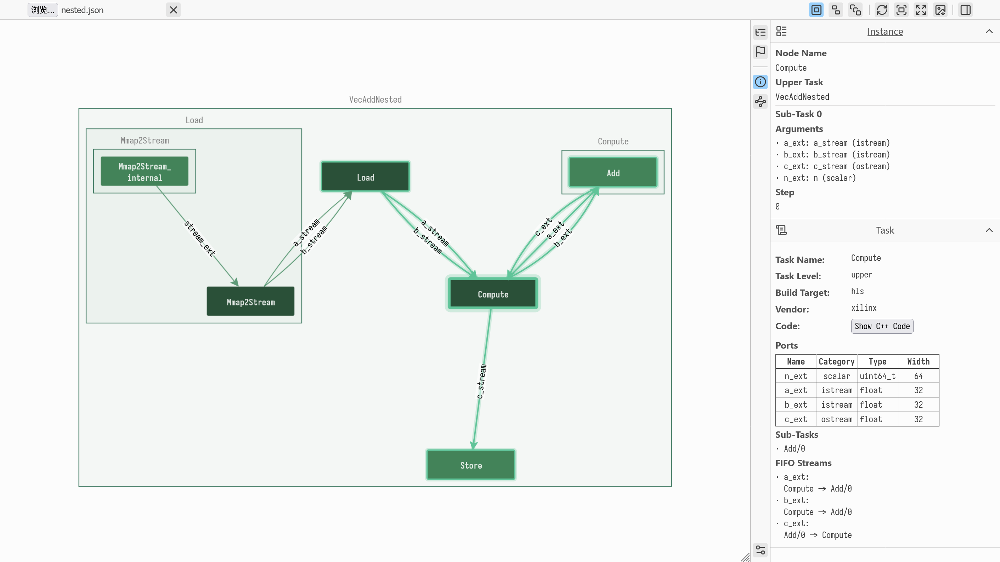
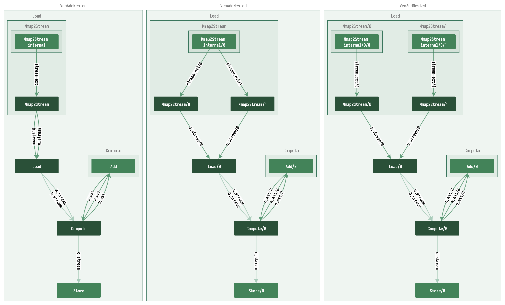
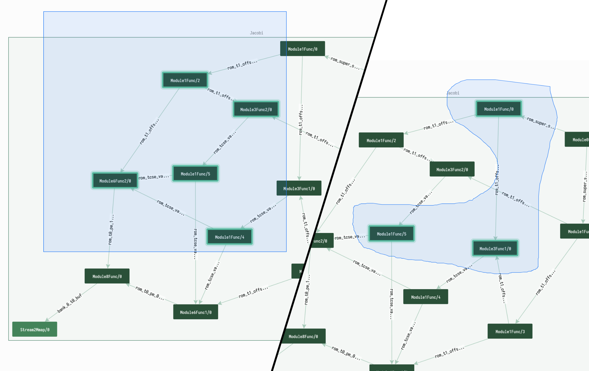
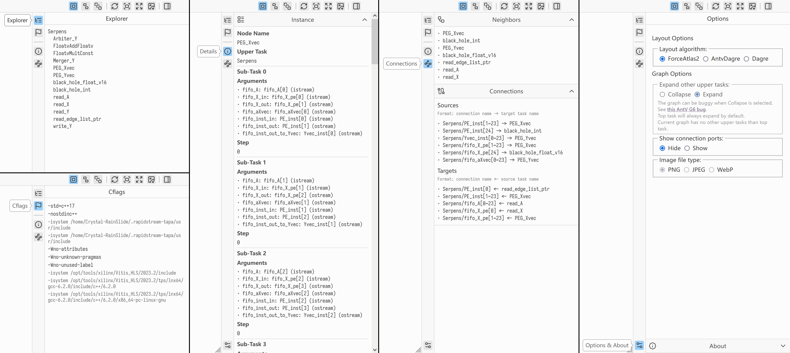

# Using the Visualizer

**Purpose:** Inspect your TAPA design's task graph and dataflow using the visualizer.

**When to use this:** When you want to understand the task hierarchy and stream connections in your design, trace data flows between tasks, or navigate complex hierarchical designs.

## What you need

- A `graph.json` file generated by `tapa compile` (found in the work directory under `work.out/`)
- A modern web browser (Chrome, Edge, Firefox, or other Chromium/Firefox-based browser)
- The TAPA Visualizer web app — build it from the `tapa-visualizer/` directory in the TAPA repository

## Getting started

1. Run `tapa compile` with a `--work-dir` to produce `graph.json`:
   ```bash
   tapa --work-dir work.out compile --top VecAdd ...
   ```
2. Open the TAPA Visualizer in your browser.
3. Click the **Choose File** input in the top-left corner and select `work.out/graph.json`.

The graph loads and renders automatically after file selection.



## Interface components

### Top toolbar

The toolbar provides controls for working with the graph:

**File controls:**
- **Choose File** — select a `graph.json` file to load.
- **Clear Graph** — remove the current graph from the view.

**Sub-task display modes** — three modes control how task instances are shown:

| Mode | Description |
|------|-------------|
| Merge Sub-task | One node per task type; all instances merged into a single node. |
| Separate Sub-task | One node per instance, named `taskname/0`, `taskname/1`, with connections named `connection/0`, `connection/1`, etc. |
| Expand Sub-task | One node per actual sub-task instance, each with its own sibling tree rather than being merged. |



The image above shows (left to right) Merge, Separate, and Expand modes. Notice the `Load` combo in the top-left: `Mmap2Stream` has 2 sub-tasks, which appear differently in each mode.

**Action buttons:**
- **Rerender Graph** — re-lays out the graph and fits it to the view. Useful for large graphs or when using progressive layout algorithms like ForceAtlas2.
- **Fit Center** — centers the graph in the view.
- **Fit View** — centers and resizes the graph to fit the current viewport.
- **Save Image** — exports the current graph as an image file.
- **Toggle Sidebar** — shows or hides the information sidebar.

```admonish tip
Hover over any toolbar button to see a tooltip with its name and function.
```

### Interactive graph

The graph represents your TAPA design as a hierarchical, directed graph:

- **Nodes** represent tasks. Color indicates connectivity: nodes with only incoming or outgoing connections appear in lighter colors; nodes with both appear darker.
- **Edges** represent connections (typically FIFO streams) between tasks.
- **Combos** (rectangular container areas) represent upper-level tasks containing nested tasks.

Supported interactions:

| Interaction | Effect |
|-------------|--------|
| Click an element | Displays its details in the sidebar. |
| Drag a node | Repositions the node. |
| Double-click a combo | Expands or collapses its contents. |
| Drag the background | Pans the view. |
| Shift+drag | Box selection. |
| Ctrl+drag | Lasso selection. |



### Sidebar



The sidebar provides detailed information through several tabs:

| Tab | Contents |
|-----|----------|
| **Explorer** | Hierarchical list of all tasks and sub-tasks; use it to quickly navigate complex designs. |
| **Cflags** | The compiler flags passed when building the graph. |
| **Details** | Comprehensive information about the currently selected element: task properties, parameters, and connectivity. |
| **Connections** | All connections and neighboring tasks for the selected element; useful for tracing data flows. |
| **Options** | Additional visualization settings: layout algorithm, task expansion options, and connection port visibility. |

## Validation

The visualizer is working correctly when:

1. The graph renders with nodes and edges visible after loading `graph.json`.
2. Clicking a node or edge populates the **Details** tab in the sidebar.
3. Double-clicking a combo expands or collapses its contents.

## Browser compatibility

| Category | Browsers |
|----------|----------|
| Fully supported | Chrome, Edge, and other Chromium-based browsers; Firefox and Firefox-based browsers |
| Partially supported | Safari and other WebKit-based browsers (should work but not extensively tested) |
| Unsupported | Internet Explorer and browsers not updated within the past 12 months |

```admonish warning
Using a modern, up-to-date browser is essential for both TAPA Visualizer compatibility and general web security.
```

---

**Next step:** [Performance Tuning](performance-tuning.md)
