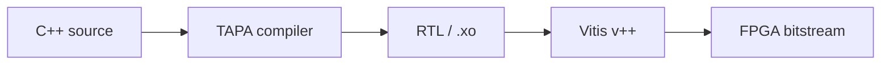

# Welcome

TAPA is a task-parallel HLS framework for building FPGA dataflow accelerators.
You write C++ where computation is expressed as communicating tasks, and TAPA
compiles it to Verilog RTL that runs on Xilinx FPGAs. You can also run software
simulations with a standard C++ compiler, without any FPGA hardware.

## Choose your path

- **New to FPGA?** → [Your First Run](first-run.md)
- **Migrating from Vitis HLS?** → [Lab 3: Migrating from Vitis HLS](../tutorials/lab-03-vitis-hls.md)
- **Already know FPGA?** → [How-To Guides](../howto/software-simulation.md)

## Most common tasks

- [Installation](installation.md)
- [Your First Run](first-run.md)
- [Fast Hardware Simulation](../howto/fast-cosim.md)
- [Build & Run on Board](../howto/build-and-run.md)
- [Debug a Deadlock](../troubleshoot/deadlocks-and-hangs.md)

**Next step:** [Installation](installation.md)
